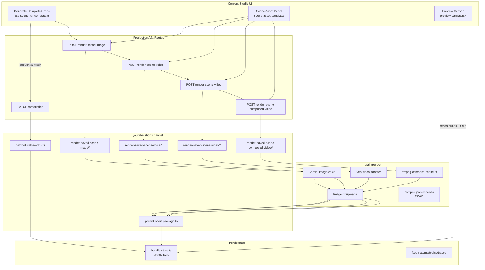
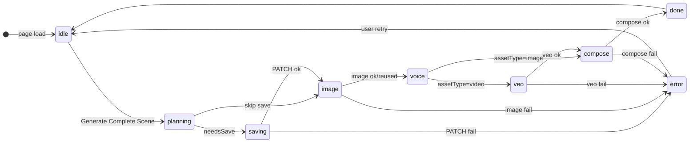

# YouTube Shorts Forensic Audit — 2026-08-02

**Audit mode:** FORENSIC | **Evidence standard:** STRICT | **Code-change mode:** AUDIT ONLY
**Report date:** 2026-08-02
**Lead:** Principal software architect (red team)

---

## 1. Executive verdict

### What the system is today

MarketMonth’s YouTube Shorts stack is an **internal-alpha, env-gated per-scene media pipeline** embedded in a Next.js content studio. It can produce **one composed MP4 per scene** when operators configure live provider env vars (`MM_IMAGE_RENDER`, `MM_VOICE_RENDER`, `MM_VIDEO_RENDER`, `MM_SCENE_COMPOSE_RENDER`) and run in a **single-instance dev-style deployment**. Domain boundaries between `content-studio` (schemas/persistence), `youtube-short` (orchestration), and `brain/render` (providers) are mostly clean. Image render has the strongest stale-protection and idempotency story.

### What it is not

It is **not** a production-hardened, multi-tenant, durable job system. It is **not** a full-package export or multi-scene stitch product. It is **not** an automated YouTube publishing platform. It is **not** safe to deploy as multi-tenant production without resolving bundle persistence, lineage invalidation, and execution durability blockers.

### Safety verdicts

| Question | Verdict |
|----------|---------|
| Safe for production (general)? | **No** |
| Safe for multiple tenants? | **No** |
| Can reliably produce a final deliverable? | **Partially** — per-scene MP4 only, env-gated, no package-level export |
| Automated YouTube publish? | **No** |

### Three most dangerous weaknesses

1. **Production bundle persistence is blocked** — `json-store.ts` throws in `NODE_ENV=production`, making all PATCH/render persistence fail in a real prod deploy.
2. **Silent stale composed output** — OST edits do not invalidate `composedVideo`; preview hides DOM overlay when composed MP4 plays, so users see old baked titles as current.
3. **No durable execution model** — browser-sequenced pipeline with no `pipelineRunId`, progress lost on refresh, stranded `running` states, duplicate provider charges under concurrency.

### Three highest-ROI remediations

1. **Migrate production bundles to Neon (or equivalent) + remove production-impossible JSON guard** — unblocks all persistence in prod.
2. **Implement lineage invalidation for OST → composed MP4 (and narration → voice/composed)** — fixes silently incorrect deliverables.
3. **Add durable scene-render job records + idempotent step execution** — replaces client-only orchestration; enables resume, cancel, and cost-safe retries.

---

## 2. Audit identity

| Field | Value |
|-------|-------|
| **Commit SHA** | `76ea62febc335ebecbb6763c848e2898f58d27d0` |
| **Branch** | `main` |
| **Working tree** | **Dirty** (~171 modified/untracked paths) |
| **Repository root** | `c:\Users\ofran\Desktop\MarketMonth` |
| **Date** | 2026-08-02 |

### Stack detected

| Component | Detection |
|-----------|-----------|
| Package manager | npm 11.9.0 |
| Runtime | Node.js v24.14.0 (CI uses 20.19) |
| Framework | Next.js 16.2.11, React 19 |
| Database | Neon PostgreSQL via `@neondatabase/serverless` + Drizzle |
| Storage (media) | ImageKit (public CDN URLs) |
| Storage (bundles) | Local JSON under `data/runtime/production-bundles/` |
| Media providers | Gemini (image/voice), OpenAI TTS, Google Veo, FFmpeg compose |
| Test runner | Node native `node:test` + tsx |
| CI | GitHub Actions — `.github/workflows/knowledge-check.yml` only |
| Hosting assumption | Next.js serverless (implied Vercel; no `vercel.json`) |

### Commands executed

| Command | Result |
|---------|--------|
| `git rev-parse HEAD` | `76ea62febc335ebecbb6763c848e2898f58d27d0` |
| `git branch --show-current` | `main` |
| `git status --porcelain` | Dirty (~171 entries) |
| `node -v` / `npm -v` | v24.14.0 / 11.9.0 |

### Tests executed

**Not executed in this audit session** — static code analysis only. Prior agent analysis parsed `package.json` test allowlist and CI workflow.

### Tests skipped / limitations

- No live provider HTTP calls (Gemini, Veo, OpenAI, ImageKit)
- No runtime HTTP tests against production routes
- No multi-tab concurrency reproduction
- No production deployment smoke

### Unavailable evidence

- Production `.env` configuration (live vs stub flags in deployed environment)
- Vercel/platform-specific request kill behavior
- Neon migration apply state in production
- End-to-end live provider demonstration

### Generated vs authoritative source

**Generated (do not treat as product doctrine):** `project-knowledge/generated/**`, `.next/**`
**Authoritative for this audit:** `src/**`, `project-knowledge/CURRENT_STATE.md`, canonical feature docs, `.env.example`

### Relevant source directories

- `src/brain/channels/youtube-short/` — channel orchestration
- `src/brain/render/` — provider adapters
- `src/brain/content-studio/` — schemas, bundle store, planners
- `src/app/api/brain/content/production/` — production API routes
- `src/components/dashboard/content/` — Content Studio UI

---

## 3. Architecture map

### Actual current architecture

| Layer | Role | Production readiness |
|-------|------|---------------------|
| UI | Browser-orchestrated multi-step pipeline; React state for progress | Fragile on refresh |
| API | Thin auth + rate limit + synchronous render execution | HTTP held open up to 300s |
| Domain | Per-scene prepare/render/persist; lazy validation gates | Image stale guard only |
| Providers | Env-gated live/stub; FFmpeg local compose | Default stub |
| Persistence | JSON bundles (dev-only prod guard); Neon for atoms | **Blocked in prod** |
| Storage | ImageKit public CDN | No signed URLs |
| Preview | Composed → Veo → still priority | Stale composed not marked |
| Export | Header button disabled | Not implemented |
| Publishing | None | Missing |
| Observability | Per-image requestId; ContentRunTrace directions-only | Fragmented |

---

## 4. Previous-claim truth table (mandatory hypotheses)

| # | Claim | Result | Confidence | Evidence | Qualification |
|---|-------|--------|------------|----------|---------------|
| 1 | OST changes do not invalidate composed MP4 | **Confirmed** | 95% | `durable-edits.ts` merges text only; `prepare-composed-video.ts` has narration drift gate but no OST drift; `preview-canvas.tsx:81-82` hides overlay when composed plays | Full-generate planner regens compose client-side only |
| 2 | Client controls full scene pipeline | **Confirmed** | 98% | `use-scene-full-generate.ts:193-359` sequential awaits | Server executes each step synchronously |
| 3 | No durable pipeline run / resumable job model | **Confirmed** | 98% | No `pipelineRunId`; progress in `useState` only | Per-asset bundle state survives refresh |
| 4 | CI does not run complete YouTube Shorts test suite | **Confirmed** | 95% | 16 youtube-short test files; 9 excluded from `npm test` allowlist | CI runs allowlist ≥2× via stabilization + quality |
| 5 | Documentation describes live paths as mocked | **Partially confirmed** | 90% | `CURRENT_STATE.md` L65,L116 blanket "Mocked"; code has env-gated live paths | `.env.example` is more accurate |
| 6 | Export is permanently disabled | **Confirmed** | 99% | `studio-header-actions.tsx:97-106` disabled button | Per-scene CDN download works when composed exists |
| 7 | JSON2Video exists but no meaningful callers | **Confirmed** | 99% | `compile-json2video.ts`; grep shows zero pipeline callers | Submit always dry_run |
| 8 | Image generation has duplicate/dead paths | **Partially confirmed** | 92% | `generate-image.ts` always stubbed, unused; live path via `renderMedia` + `live-image-adapter.ts` | Not duplicate logic, duplicate entry points |
| 9 | Authentication logic duplicated across routes | **Confirmed** | 95% | `auth-context.ts` exists but render routes duplicate inline auth | 4 render routes + ingest |
| 10 | Authorization failures mislabeled as unauthenticated | **Confirmed** | 95% | `render-scene-video/route.ts:51-59` code `short_video.unauthenticated` with status 403 | HTTP status correct; code wrong |
| 11 | Large scene asset component contains duplicated workflow decisions | **Partially confirmed** | 88% | `scene-asset-panel.tsx` duplicates gating rules from hooks; ~709 LOC | Complexity is rule duplication, not only line count |
| 12 | Provider calls lack complete correlation/cost metadata | **Confirmed** | 92% | Image has requestId/jobId; voice/video/compose lack; no cross-stage runId; `estimatedCostUsd` never set | ContentRunTrace unused for media |
| 13 | Live Gemini/Veo/voice/storage/FFmpeg not demonstrated E2E | **Partially confirmed** | 85% | Live adapter code exists; excluded tests cover live paths; no CI enforcement; no runtime demo in audit | Unit tests with mocks, not live HTTP |
| 14 | Existing scores overstate production readiness | **Confirmed** | 90% | Docs say "Mocked"; ops layer ~3/10; prod bundle store blocked | Architecture layer stronger (~6.5/10) |
| 15 | Operational state stored in content records vs execution records | **Confirmed** | 93% | `scene.render/voice/video/composedVideo` on `SceneCard`; no job table | Image has richest operational fields |

---

## 5. System state machines

### Scene generation run (inferred — no explicit model)

**Missing transitions:** resume after refresh, cancel in-flight, timeout recovery, idempotent retry.

### Individual asset generation (per scene field)

| Asset | States | Stale guard | In-flight dedupe |
|-------|--------|-------------|------------------|
| `scene.render` | idle → queued → running → succeeded/dry_run_succeeded/failed | **Yes** (`apply-stale-or-final.ts`) | No |
| `scene.voice` | idle → running → succeeded/failed/stubbed | No | No |
| `scene.video` | idle → running → succeeded/failed/stubbed | No | No |
| `scene.composedVideo` | idle → running → succeeded/failed/stubbed | No (narration drift at prepare only) | No |

**Impossible recovery states:** `running` with no TTL/sweeper after platform kill or client disconnect.

### Composed asset freshness

No explicit freshness state machine. Freshness is inferred by:
- Client planner (`plan-scene-full-generate.ts`) — full-generate only
- Compose-time narration drift gate — blocks recompose, does not clear stale MP4
- **No OST drift detection**

### Export

Single state: **disabled** (`studio-header-actions.tsx`).

### Publishing

**Does not exist.**

---

## 6. Ranked findings

### Summary table

| ID | Priority | Risk | Conf | Category | Finding | Root cause | Blast | Fix | Owner |
|----|----------|------|------|----------|---------|------------|-------|-----|-------|
| F-001 | P0 | 85 | 98% | Persistence | JSON bundle store throws in production | ADR 0006 not implemented; `assertDevRuntime()` | All tenants | L | Platform |
| F-002 | P0 | 88 | 95% | Lineage | OST edit leaves stale composed MP4; preview shows baked old title | No PATCH invalidation; no OST drift gate; preview hides DOM overlay | Per scene/tenant | M | Domain |
| F-003 | P1 | 78 | 95% | Execution | Client-only orchestration; no pipeline run ID | No server workflow layer | Multi-step runs | L | Platform |
| F-004 | P1 | 82 | 92% | Execution | Stranded `running`; Veo poll 600s vs route 300s | Sync in-request polling; no sweeper | Per scene | M | Platform |
| F-005 | P1 | 76 | 95% | Cost | Duplicate provider charges under concurrent requests | No idempotency keys; no in-flight lock | Cost exposure | M | Platform |
| F-006 | P1 | 72 | 90% | CI | 9/16 youtube-short tests excluded from CI | Manual test allowlist drift | Release quality | S | Eng |
| F-007 | P1 | 70 | 95% | CI | Zero HTTP tests for production render routes | Static string tests only | Regressions | M | Eng |
| F-008 | P1 | 74 | 92% | Media | `succeeded` without decode/integrity validation | Trust FFmpeg exit + upload response | Bad deliverables | M | Media |
| F-009 | P1 | 68 | 90% | Security | Cross-tenant atom enumeration via 403 vs 404 | Route gate exposes existence | Tenant privacy | S | Security |
| F-010 | P1 | 71 | 88% | Security | Latent SSRF on bundle-stored URLs in fetch/compose | No URL allowlist on server-side fetch | Server egress | M | Security |
| F-011 | P2 | 58 | 85% | Observability | No end-to-end correlation across pipeline steps | Fragmented ID namespaces | Diagnosis | L | Platform |
| F-012 | P2 | 55 | 90% | Docs | CURRENT_STATE blanket "Mocked" misleads engineers | Doc not updated for Phase 4 | Wrong decisions | S | Docs |
| F-013 | P2 | 52 | 88% | UI | Stale assets shown as "Generated"/"Ready" after save | No provenance compare in badges | Operator confusion | M | UI |
| F-014 | P3 | 38 | 95% | Product | Full-package export and multi-scene stitch missing | Planned not implemented | Workflow gap | XL | Product |
| F-015 | P3 | 35 | 99% | Product | JSON2Video compile-only, zero callers | Intentional stub | None at runtime | XS | Cleanup |

### P0/P1 detail

#### F-001 — Production bundle persistence blocked (P0, Risk 85)

1. **Defect:** `writeJsonAtomic` calls `assertDevRuntime()` which throws when `NODE_ENV=production`.
2. **Missing invariant:** Production bundles must persist in tenant-scoped durable storage.
3. **Process enabler:** ADR 0006 documented Neon migration but not shipped for bundles.
4. **Why tests missed it:** Tests run with `NODE_ENV=test/development`.
5. **Recurrence pattern:** Any dev-only store guard will break prod silently until deploy.
6. **Remediation:** Neon `content_production_bundles` table or S3 + pointer; remove prod throw.
7. **Containment:** Do not deploy Short production routes to prod NODE_ENV until migrated.
8. **Verification:** Integration test with `NODE_ENV=production` + DATABASE_URL persists bundle.
9. **Regression test:** Prod-mode bundle save/load round-trip.

**Evidence:** `src/brain/store/json-store.ts:13-17`

#### F-002 — OST stale composed MP4 (P0, Risk 88)

1. **Defect:** PATCH `onScreenText` does not clear or mark stale `composedVideo`.
2. **Missing invariant:** Any source field change must invalidate or block downstream assets that embed it.
3. **Process enabler:** Generate Complete Scene v1 explicitly deferred OST invalidation.
4. **Why tests missed it:** Test proves voice retained after OST patch (`render-saved-scene-voice.test.ts`) but not composed staleness UX.
5. **Recurrence:** Every PATCH-only merge path without invalidation graph.
6. **Remediation:** On OST change: clear `composedVideo` or set `stale: true`; add compose-time OST drift gate; show stale badge in UI.
7. **Containment:** Document that OST change requires manual recompose; show warning in UI.
8. **Verification:** PATCH OST → preview must not show old composed without stale indicator.
9. **Regression test:** OST patch → composed invalidated or compose blocked with clear code.

**Evidence:** `durable-edits.ts:48-57`, `prepare-composed-video.ts:98-108` (narration only), `preview-canvas.tsx:70-82`

#### F-003 — Client-only orchestration (P1, Risk 78)

1. **Defect:** Multi-step pipeline lives in browser `useState`; no server coordinator.
2. **Missing invariant:** Long-running workflows must survive refresh/disconnect.
3. **Process enabler:** Incremental Phase 4 delivery without job infrastructure.
4. **Why tests missed it:** Hook tests don't simulate refresh mid-run.
5. **Recurrence:** Any new multi-step feature will repeat pattern.
6. **Remediation:** Server `pipelineRunId` + step records; poll GET status endpoint.
7. **Containment:** Warn users not to refresh during Generate Complete Scene.
8. **Verification:** Kill browser mid-Veo; reload shows resumable state.
9. **Regression test:** Simulated disconnect + resume.

**Evidence:** `use-scene-full-generate.ts:105-110,193-359`

#### F-004 — Stranded running / timeout mismatch (P1, Risk 82)

1. **Defect:** Veo default poll budget ~600s; route `maxDuration=300s`.
2. **Missing invariant:** In-flight work must transition to terminal state on platform timeout.
3. **Process enabler:** Serverless route limits not aligned with provider poll config.
4. **Why tests missed it:** Mocked provider tests don't simulate platform kill.
5. **Recurrence:** Any long sync handler on serverless.
6. **Remediation:** Background job for Veo; align timeouts; stale-`running` sweeper.
7. **Containment:** Reduce `MM_VIDEO_MAX_POLLS` to fit 300s budget.
8. **Verification:** Force timeout → bundle shows `failed`, not perpetual `running`.
9. **Regression test:** Timeout scenario with asserted terminal state.

**Evidence:** `veo-video-generate.ts:51-52,131-141`, `render-scene-video/route.ts:14-15`

#### F-005 — Duplicate provider charges (P1, Risk 76)

1. **Defect:** No idempotency keys; voice/video/compose use `Date.now()` filenames.
2. **Missing invariant:** Retries must not create billable duplicate work.
3. **Process enabler:** Rate limit (30/min) treated as sufficient protection.
4. **Why tests missed it:** No concurrency tests for render routes.
5. **Recurrence:** Every provider adapter without dedupe.
6. **Remediation:** Idempotency key per (atomId, sceneId, step, sourceRevision); reject concurrent in-flight.
7. **Containment:** UI mutex ref (not just React state); server in-flight lock.
8. **Verification:** Parallel POSTs → one provider call.
9. **Regression test:** Concurrent render-scene-video requests.

**Evidence:** `imagekit-video-upload.ts:139`, `apply-stale-or-final.ts` (image only)

---

## 7. Dependency and invalidation matrix

Rows = source mutations. Columns = downstream assets.

| Mutation | Still | Voice | Motion | Composed MP4 |
|----------|-------|-------|--------|--------------|
| PATCH visualPrompt | Not invalidated | Not invalidated | Not invalidated | Not invalidated |
| PATCH onScreenText | N/A | Not invalidated | N/A | **Not invalidated** |
| PATCH narration | N/A | Not invalidated | N/A | Guarded at completion (compose blocked) |
| PATCH motionPrompt | N/A | N/A | Not invalidated | Not invalidated |
| PATCH assetType | Not invalidated (hash changes) | Not invalidated | Not invalidated | Not invalidated |
| PATCH globalVisualStyle | Not invalidated | Not invalidated | Not invalidated | Not invalidated |
| Regenerate still | Replace | — | — | — |
| Regenerate voice | — | Replace | — | — |
| Regenerate motion | — | — | Replace | — |
| Compose | — | — | — | Replace |
| Clear voice | — | Explicit clear | — | **Not invalidated** |
| Clear motion | — | — | Explicit clear | **Not invalidated** |
| Image render in-flight + PATCH | **Guarded** (stale reject) | — | — | — |
| Full-generate planner | Planner cascade | Planner cascade | Planner cascade | Planner cascade |

Legend: **Guarded at completion** = blocked at next compose attempt, stale asset may remain.

---

## 8. Test and CI truth table

| Suite | Files | Local allowlist | CI | Merge block | Coverage | Major gap |
|-------|-------|-----------------|-----|-------------|----------|-----------|
| All tests on disk | 127 | — | — | — | — | 24 excluded |
| `npm test` allowlist | 103 | Yes | Yes (≥2×) | Yes | Broad brain/discovery | Manual registration |
| YouTube-short channel | 16 | 7 | 7 | Yes | Structure, ingest, image | Voice/video/compose excluded |
| Render adapters (voice/video/ffmpeg) | 6 | 0 | 0 | No | — | All excluded |
| `plan-scene-full-generate` | 1 | 0 | 0 | No | — | Full-generate planner untested in CI |
| Production API HTTP tests | 0 | 0 | 0 | No | — | **Critical gap** |
| Concurrency render tests | 0 | 0 | 0 | No | — | Race conditions untested |
| Live provider path tests | 4 files | 0 | 0 | No | Exist locally | Excluded from gates |
| Integration full pipeline | 1 | 0 | 0 | No | `content-studio-production.test.ts` | Excluded |

**CI workflow:** `.github/workflows/knowledge-check.yml` — runs `validate:stabilization` (includes `npm test`) + `quality:check` (includes `npm test` again). No dedicated test workflow name.

---

## 9. Provider and media capability matrix

| Provider / Renderer | Live | Stub | Dry-run | Dead | Reachable | Retry | Idempotency | Validation | Telemetry | Cost track | Known failure |
|---------------------|------|------|---------|------|-----------|-------|-------------|------------|-----------|------------|---------------|
| Gemini image (Phase 4B) | Env | — | Default | — | Yes | Manual | Partial (hash+requestId path) | Dry-run contract | requestId, jobId | No | Silent dry-run if misconfig |
| `generate-image.ts` | — | Always | — | **Yes** | No | — | — | — | — | — | Misleading if wired |
| OpenAI/Gemini voice | Env | Default | — | — | Yes | Manual | No (timestamp files) | duration missing (OpenAI) | timestamps only | No | Compose blocked |
| Veo video | Env+veo | Default | — | — | Yes | Manual | No | Poll timeout | timestamps | No | 600s poll vs 300s route |
| FFmpeg compose | Env | Default | — | — | Yes | Manual | No | Exit code only | timestamps | No | No post-upload verify |
| ImageKit storage | Env | — | — | — | Yes | None | Unique filenames | HTTP 200 only | bytes in adapter | No | Orphan on persist fail |
| JSON2Video | — | — | Always | Submit dead | Compile only | — | — | — | — | — | Key ignored |

**Default env:** Image dry-run; voice/video/compose stub. Stub URLs can persist in bundle (`stub://voice/narration`, etc.).

---

## 10. Security and tenant-isolation assessment

| Control | Status | Evidence |
|---------|--------|----------|
| Session auth (prod) | Present | `require-api-session.ts`; bypass disabled in prod |
| Dev auth bypass | Risk if misconfigured | `auth-mode.ts` — ON when not production |
| Tenant check via atom owner | Present | `auth-context.ts`, `requireCompanyAccess` |
| Cross-tenant enumeration | **Gap** | 403 vs 404 at route gate |
| Rate limiting | Present, post-auth | 30/min per namespace; not on failed auth |
| Client URL injection on render | Blocked | Routes accept atomId+sceneId only |
| PATCH assetUrl injection | Blocked | Schema excludes asset URLs |
| Signed media URLs | **Absent** | Public ImageKit CDN |
| Bundle filesystem isolation | Weak | Keyed by atomId only |
| SSRF on server fetch | **Latent** | `fetch-still.ts`, `ffmpeg-compose-scene.ts` — no host allowlist |
| 403 code semantics | **Wrong** | `short_*.unauthenticated` on 403 |
| Secret logging in routes | Low | No console in production routes |
| CSRF / Origin validation | **Absent** | Relies on session cookie |
| Audit logging | **Absent** | No structured audit trail for render ops |

**Not safe for multi-tenant production** without: bundle store migration, enumeration-safe errors, signed URLs or access-controlled downloads, SSRF allowlist, render audit log.

---

## 11. Production-readiness score

### Architecture quality (40% weight)

| Dimension | Weight | Score /10 | Weighted |
|-----------|--------|-----------|----------|
| Domain model | 15% | 7.0 | 1.05 |
| Boundary quality | 10% | 7.0 | 0.70 |
| Maintainability | 10% | 5.0 | 0.50 |
| Extensibility | 5% | 7.0 | 0.35 |
| **Subtotal** | **40%** | | **6.5 / 10** |

### Operational production readiness (60% weight)

| Dimension | Weight | Score /10 | Weighted |
|-----------|--------|-----------|----------|
| Durable execution | 15% | 2.0 | 0.30 |
| Correctness and lineage | 15% | 4.0 | 0.60 |
| Testing and release gates | 10% | 4.0 | 0.40 |
| Security and tenancy | 10% | 6.0 | 0.60 |
| Observability and cost control | 5% | 3.0 | 0.15 |
| Export and recoverability | 5% | 2.0 | 0.10 |
| **Subtotal** | **60%** | | **3.6 / 10** |

### Combined

| Metric | Score |
|--------|-------|
| Architecture quality | **6.5 / 10** |
| Operational readiness | **3.6 / 10** |
| **Combined weighted** | **6.5×0.4 + 3.6×0.6 = 4.8 / 10** |

### Classification

**Internal alpha** — functional for single-operator, single-instance, env-configured dev/staging workflows. Not production-ready. Not production-hardened.

---

## 12. Exact weakness diagnosis

> The primary architectural weakness is **mixing durable content state with ephemeral execution state on the same scene record without a lineage invalidation graph** because **PATCH merges text fields while leaving render/voice/video/composedVideo slots untouched and only image render implements stale-result protection**. It causes **silently incorrect composed MP4 previews and blocked or inconsistent downstream steps** under **normal edit-after-generate workflows (especially OST and narration changes)**. The system currently lacks the invariant **"no succeeded downstream asset may remain when any upstream source field it embeds has changed"**. The evidence is **`durable-edits.ts` merge-only behavior, absent OST drift in `prepare-composed-video.ts`, and `preview-canvas.tsx` composed-priority display without staleness checks**. The first corrective move is **implement explicit invalidation (or stale flags) for OST → composedVideo and narration → voice/composedVideo on PATCH, with UI stale badges**.

| Diagnosis | Statement |
|-----------|-----------|
| Primary weakness | No lineage invalidation graph on content records |
| Secondary weakness | No durable job/pipeline execution layer |
| Hidden systemic weakness | Production bundle persistence still dev-only JSON |
| Most likely future incident | User edits OST, preview shows old composed title |
| Most expensive future incident | Duplicate Veo/voice charges from concurrent retries |
| Hardest-to-detect future incident | `succeeded` composed MP4 that fails to decode/play |

---

## 13. Remediation plan

### Immediate containment (0–2 days)

| Item | Files | Change | Tests | Acceptance | Days | Risk reduced |
|------|-------|--------|-------|------------|------|--------------|
| OST stale UI warning | `preview-canvas.tsx`, `scene-asset-panel.tsx` | Compare `onScreenText` vs `composedVideo.onScreenTextUsed`; show banner | UI test | Stale visible after OST save | 1 | F-002 partial |
| Veo timeout alignment | `.env.example`, docs | Set max polls × interval ≤ 300s | Config test | No poll beyond route budget | 0.5 | F-004 partial |
| Block prod deploy | Runbook | Document NODE_ENV=production bundle failure | — | No prod deploy without migration | 0.5 | F-001 |
| Add excluded tests to allowlist | `package.json` | Register checkpoint C/D tests | CI green | Voice/video/compose tests in CI | 1 | F-006 |

### Reliability foundation (3–10 days)

| Item | Files | Change | Tests | Acceptance | Days | Risk reduced |
|------|-------|--------|-------|------------|------|--------------|
| OST → composed invalidation | `durable-edits.ts`, `patch-durable-edits.ts` | Clear or mark stale on OST change | Unit + integration | PATCH OST clears composed | 2 | F-002 |
| Neon bundle store | `bundle-store.ts`, schema, migration | Replace JSON prod path | Prod-mode persist test | Prod bundle round-trip | 5 | F-001 |
| In-flight render lock | Render prepare modules | Reject if status=running | Concurrency test | Duplicate POST → 409 | 3 | F-005 |
| HTTP route smoke tests | `src/app/api/brain/content/production/*.test.ts` | Auth + 422 gates | CI | All render routes covered | 3 | F-007 |
| Unify render auth | `auth-context.ts`, render routes | Deduplicate; fix 403 codes | Route tests | Single auth module | 2 | F-009 partial |

### Production hardening (2–6 weeks)

| Item | Files | Change | Tests | Acceptance | Days | Risk reduced |
|------|-------|--------|-------|------------|------|--------------|
| Durable pipeline runs | New job schema + API | Server orchestrator with pipelineRunId | E2E resume | Refresh resumes | 10 | F-003 |
| Stale guards all assets | voice/video/compose render | Port `apply-stale-or-final` pattern | Concurrency tests | PATCH during render safe | 5 | F-004, F-005 |
| Media preflight | `ffmpeg-compose-scene.ts`, persist | ffprobe + post-upload HEAD | Media tests | succeeded implies playable | 5 | F-008 |
| Signed download URLs | ImageKit config + API | Time-limited access | Security test | No public permanent URLs | 5 | Security |
| SSRF allowlist | `fetch-still.ts`, ffmpeg download | ImageKit host only | Unit test | Internal URL blocked | 2 | F-010 |
| Observability | Render routes | requestId all steps; pipeline correlation | Trace test | One action traceable | 5 | F-011 |

### Competitive capabilities (after reliability gates)

- Multi-scene stitch / full-package export
- YouTube OAuth + upload
- JSON2Video or remove dead code
- Human QA gates in workflow

---

## 14. Release gates

### Internal testing

- [ ] All 16 youtube-short test files in `npm test` allowlist and passing
- [ ] HTTP smoke tests for all 10 production routes
- [ ] PATCH OST invalidates or blocks stale composed MP4

### Limited production (single tenant, env-gated live)

- [ ] Production bundle persists with `NODE_ENV=production` + DATABASE_URL
- [ ] Duplicate render POST returns 409 or reuses in-flight job (no double Veo charge)
- [ ] Stranded `running` transitions to `failed` within TTL

### Multi-tenant production

- [ ] Cross-tenant atom access returns uniform 404 (no enumeration)
- [ ] Bundle `companyId` verified against atom owner on every load
- [ ] Media downloads require auth or signed URL
- [ ] Per-tenant render cost/concurrency limits enforced

### Automated YouTube publishing

- [ ] OAuth with upload scope + durable upload session
- [ ] Full-package MP4 export passes media preflight
- [ ] Publish workflow survives worker restart

---

## 15. Evidence appendix

### End-to-end traces (fleet joint)

#### Trace A — Complete scene generation

1. UI: `scene-asset-panel.tsx` → `generateCompleteScene()` in `use-scene-full-generate.ts`
2. Plan: `planSceneFullGenerate()` — client-only
3. Save: `patchShortDurableEdits()` → `PATCH /api/brain/content/production`
4. Image: `POST .../render-scene-image` → `renderYouTubeShortSavedSceneImage` → `renderMedia` → persist `scene.render`
5. Voice: `POST .../render-scene-voice` → TTS → ImageKit → `scene.voice`
6. Video (if assetType=video): `POST .../render-scene-video` → Veo poll → ImageKit → `scene.video`
7. Compose: `POST .../render-scene-composed-video` → FFmpeg → ImageKit → `scene.composedVideo`
8. Preview: `preview-canvas.tsx` reads `composedVideo.assetUrl`
9. Download: anchor tags to ImageKit CDN URL

**Gap:** Progress lost on refresh; no pipeline run ID.

#### Trace B — Edit after composition

1. User edits OST in `scene-editor.tsx`
2. Save → PATCH → `applyDurableEditsToShortPackage` — **composedVideo unchanged**
3. Preview: composed MP4 still plays; DOM overlay hidden (`preview-canvas.tsx:81-82`)
4. Recompose: allowed without OST drift gate; may produce new MP4 if user clicks compose
5. Export: N/A (disabled)

#### Trace C — Failure and retry

| Scenario | Current result |
|----------|----------------|
| Provider timeout | `failed` + retryable; client shows error; no auto-retry |
| Provider success, lost response | Likely `failed` or stuck `running`; retry = new charge |
| Duplicate user command | Duplicate provider calls possible |
| Refresh during execution | Client error; server may complete; stepper lost |
| Process restart | Stuck `running`; no resume |
| Retry | Manual; image preserves prior URL; voice/video may orphan files |

#### Trace D — Tenant boundary

1. Request → `requireApiSession()` → 401 if no session
2. `findLatestByAtomId(atomId)` — global lookup
3. `requireCompanyAccess(userId, stored.company_id)` → 403 if wrong tenant
4. Bundle load/save by atomId path — no company in filesystem path
5. ImageKit path: `marketmonth/atoms/{atomId}/...` — no company segment
6. Download: public CDN URL — no re-auth

#### Trace E — Final deliverable

| Deliverable | Status |
|-------------|--------|
| Per-scene composed MP4 | **Exists** (env-gated live) |
| Multi-scene final MP4 | **Missing** |
| Full-package export | **Disabled** |
| YouTube upload | **Missing** |

### Key symbols inspected

| Path | Symbols |
|------|---------|
| `src/brain/store/json-store.ts` | `assertDevRuntime`, `writeJsonAtomic` |
| `src/brain/channels/youtube-short/durable-edits.ts` | `resolveEffectiveScene`, `applyDurableEditsToShortPackage` |
| `src/brain/channels/youtube-short/patch-durable-edits.ts` | `patchYouTubeShortDurableEdits` |
| `src/brain/channels/youtube-short/render-saved-scene-image/apply-stale-or-final.ts` | `applyStaleOrFinal` |
| `src/brain/channels/youtube-short/render-saved-scene-composed-video/prepare-composed-video.ts` | narration drift gate |
| `src/brain/content-studio/plan-scene-full-generate.ts` | reuse planner |
| `src/components/.../use-scene-full-generate.ts` | `generateCompleteScene` |
| `src/components/.../scene-asset-panel.tsx` | asset controls |
| `src/components/.../preview-canvas.tsx` | media priority |
| `src/components/.../studio-header-actions.tsx` | disabled export |
| `src/brain/render/compose-scene-video.ts` | stub/live gate |
| `src/brain/render/compile-json2video.ts` | dead submit |
| `src/brain/render/adapters/veo-video-generate.ts` | poll loop |
| `src/app/api/brain/content/production/*` | all 10 handlers |

### Agent fleet

12 independent explore agents executed in parallel (architecture, execution, lineage, providers, media, observability, CI, security, UI, export, docs, deployment). Findings consolidated by lead with contradiction resolution via direct file re-read.

### Quality control checklist

| Question | Answer |
|----------|--------|
| Findings based on file size? | No |
| Unused paths checked for dynamic load? | Yes — JSON2Video grep confirmed |
| Test conclusions from filenames only? | No — allowlist parsed |
| Runtime claims from env names only? | No — code paths traced |
| Security from middleware only? | No — no middleware exists |
| Generic recommendations? | No — tied to cited modules |
| Missing features labeled as bugs? | Export/publish classified as missing capabilities |
| Priority scores use formula? | Yes — see F-001–F-005 |
| P0/P1 have reproduction/evidence gap? | Yes — all cited |
| Verified vs inference distinguished? | Yes — throughout |
| Reproducible by another architect? | Yes — SHA + paths provided |

---

**Evidence label for this report:** **Partially verified** — grounded in commit `76ea62febc335ebecbb6763c848e2898f58d27d0` static analysis and 12-agent file inspection; live runtime behavior not executed in this session.
