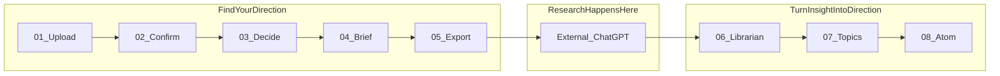
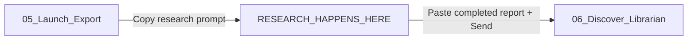

# Content Intelligence — Customer Journey UX Audit

- **Audit version:** 1.0.0
- **Generated at:** 2026-08-13
- **Mode:** Evidence-based presentation audit; no production code modified
- **APS taskType:** audit
- **Deliverable scope:** Information architecture, terminology, hierarchy, progressive disclosure — not backend redesign

Evidence tags used below: **Observed in code** · **UX recommendation** · **Inference requiring validation**

---

## 1. Executive verdict

The product already implements a coherent end-to-end journey: build a company-specific research assignment, leave the app to run research in ChatGPT, bring findings back, govern them, choose a topic, and leave with a Canonical Topic Packet. **Observed in code.**

The left rail does not tell that story. It flattens two workflows, an external handoff, mixed interaction types, and a final outcome into one eight-item peer list:

`Upload → Confirm → Decide → Brief → Export → Librarian → Topics → Atom`

That list leaks internal architecture (Librarian, Atom, Packet Identity IDs, `PublishedLibraryDto`) into customer chrome. The disconnect is primarily **information architecture and vocabulary**, not a missing workflow engine. **UX recommendation:** ship a three-phase customer rail (documented in §17) without renaming `AppStage`, routes, schemas, or freeze boundaries.

**Target dashboard (locked; not yet implemented):**

**FIND YOUR DIRECTION** — Upload · Align · Focus · Frame · Launch  
**RESEARCH HAPPENS HERE** — named divider (not a ninth step)  
**TURN INSIGHT INTO DIRECTION** — Discover · Lock It In · Ready

---

## 2. Actual customer journey versus the eight-item rail

Canon and product copy already describe the real journey (`project-knowledge/PRODUCT.md` lines 47–51):

```text
Ingestion → Understanding → Interview → Research Brief → Final Prompt (export)
  → (external ChatGPT research)
  → Content Intelligence Librarian
  → Topic Engine (Atom)
```

Live rail labels differ from that story (`STAGE_LABELS` in `src/features/research-prompt-builder/config/constants.ts:17-23`; CI `STEP_META` in `content-intelligence-rail.tsx:46-53`):

| # | Live rail label | Internal ID / surface | Actual customer job |
|---|-----------------|----------------------|---------------------|
| 01 | Upload | `ingestion` | Bring company evidence in |
| 02 | Confirm | `understanding` | Align on what the system understood |
| 03 | Decide | `interview` | Lock research focus |
| 04 | Brief | `brief` | Approve the research plan |
| 05 | Export | `prompt` | Launch the ChatGPT assignment |
| — | *(absent from rail)* | external ChatGPT | Run research outside the app |
| 06 | Librarian | CI library | Discover governed findings |
| 07 | Topics | Topic Engine | Lock direction then topic |
| 08 | Atom | `session.stage === "ready"` | Ready state + Canonical Topic Packet |

**Observed in code:** RPB rail shows `NN / 05` (`stage-rail.tsx:48-49`). CI rail shows `NN / 08` and lists 01–05 as non-interactive text (`content-intelligence-rail.tsx:82-84`, `:95-108`). Neither rail is clickable.

---

## 3. Two workflows, one list



**Observed in code:** Upload still promises “One CSV in. One ChatGPT research prompt out.” (`ingestion-dropzone.tsx`). After Export, CI pretends the same numbered chore list continues to Atom. Two products (Research Prompt Builder + Content Intelligence) share one visual continuum without phase headers.

**UX recommendation:** Keep eight orientation items, add two phase headers, and insert **RESEARCH HAPPENS HERE** as a named divider between 05 and 06 — not a ninth numbered step.

---

## 4. Interaction-type mismatch

The eight peer numbers imply eight equivalent “tasks.” They are not. **Observed in code:**

| # | Live label | Interaction type | Driver |
|---|------------|------------------|--------|
| 01 | Upload | Customer action + system analysis | Customer + system |
| 02 | Confirm | Customer review/decision | Customer |
| 03 | Decide | Collaborative adaptive interview | Collaborative |
| 04 | Brief | Customer approval of system draft | Customer |
| 05 | Export | Customer action + external work | Customer + external |
| 06 | Librarian | Mostly system extract/curate; exceptions | Mostly system |
| 07 | Topics | Two decisions (direction, then topic) behind one label | Collaborative |
| 08 | Atom | Outcome / ready state (packet built locally on select) | Informational outcome |

**UX recommendation:** Treat 08 as an outcome (“Ready”), not a peer task. Keep Topics as one rail item with in-page Direction → Topic progress. Do not invent a ninth rail item for ChatGPT; use a divider.

---

## 5. Architecture leakage inventory

| Leak | Where customers see it | Evidence |
|------|------------------------|----------|
| Librarian | Rail `06 Librarian`, H1 `Librarian` | `content-intelligence-rail.tsx:50`, `librarian-shell.tsx:256` |
| Atom | Rail `08 Atom`, H1/H2 `Atom` | `content-intelligence-rail.tsx:52`, `topic-engine-shell.tsx:296-298`, `topic-ready-view.tsx:66` |
| Canonical Topic Packet / machine handoff | Rail why-copy; Atom body | `content-intelligence-rail.tsx:26-27`; `topic-ready-view.tsx:67-71` |
| Packet Identity IDs first | First content block on Step 08 | `topic-ready-view.tsx:91-104` (`topicPacketId`, `territoryId`, `artifactId`, …) |
| TOPIC ENGINE | Eyebrow on Topics/Atom | `topic-engine-shell.tsx:293-295` |
| `PublishedLibraryDto` | Blocked-state error copy | `topic-engine-shell.tsx:257-261` |
| Supporting item IDs | Primary Atom sections | `topic-ready-view.tsx` (Supporting item IDs block) |
| Decide as bare H1 | Interview workspace eyebrow | `interview-workspace.tsx:76` (no “Step 3 of 5”) |

Owner screenshots (2026-08-13) corroborate: flattened 01–08 list; Step 08 leads with Packet Identity and Atom/Canonical handoff chrome. **Observed in code** + screenshot evidence.

---

## 6. External ChatGPT boundary — RESEARCH HAPPENS HERE

**Observed in code:** ChatGPT is a major **product** boundary between Export and Librarian (`PRODUCT.md:47-51`), but the rail does not name it. It appears only as Step 5 microcopy:

- Rail why: “1) Copy prompt → ChatGPT. 2) Paste ChatGPT’s answer here — not the prompt.” (`stage-copy.ts:16-18`)
- Viewer: “1 · Copy into ChatGPT” (`final-prompt-viewer.tsx:93`)
- Handoff: “2 · Paste ChatGPT’s answer” / “Send to Content Intelligence” (`research-handoff-panel.tsx:66-88`)



**UX recommendation:** Surface a named divider between 05 and 06:

**RESEARCH HAPPENS HERE**  
*Take the assignment to ChatGPT. Bring the completed research back.*

Do not number it 05.5 or 09. Keep the copy/paste contract on the Launch page; make the boundary visible in the rail itself.

---

## 7. Stage 01 Upload — input, system, user, output, completion, next

| Field | Detail |
|-------|--------|
| **Live label** | Upload (`STAGE_LABELS.ingestion`) |
| **Target label** | Upload — *Bring in what you know.* |
| **Route** | `/` via `AppShell` |
| **Input** | Company CSV (allowlisted) |
| **System activity** | Sanitize → evidence packet → `POST /api/company/understand` |
| **User activity** | Drop/browse CSV (or sample) → Analyze company |
| **Output** | `companyUnderstanding` + ingestion meta |
| **Completion** | `INGESTION_SUCCESS` → `UNDERSTANDING_REVIEW` |
| **Next** | Align (Confirm) |

**Evidence:** `ingestion-dropzone.tsx` (“Step 1 of 5”, “One CSV in…”); `stage-rail.tsx` `01 / 05`. **Observed in code.**

---

## 8. Stage 02 Confirm (customer: Align)

| Field | Detail |
|-------|--------|
| **Live label** | Confirm |
| **Target label** | Align — *Make sure we're seeing the same thing.* |
| **Route** | `/` |
| **Input** | `companyUnderstanding` |
| **System activity** | Present five review sections with provenance labels |
| **User activity** | Review/edit; Looks right per section; continue |
| **Output** | `ConfirmedCompanyProfile` |
| **Completion** | `SET_CONFIRMED_PROFILE` → `INTERVIEWING` |
| **Next** | Focus (Decide) |

**Evidence:** `company-understanding.tsx` (“Step 2 of 5”); why-copy “Wrong facts here become wrong research later.” (`stage-copy.ts:10-12`). **Observed in code.**

---

## 9. Stage 03 Decide (customer: Focus)

| Field | Detail |
|-------|--------|
| **Live label** | Decide |
| **Target label** | Focus — *Choose what matters most.* |
| **Route** | `/` |
| **Input** | Confirmed profile (+ prior answers) |
| **System activity** | Adaptive `POST /api/interview/next`; optional doc extract |
| **User activity** | Answer one decision at a time; optional Change on prior |
| **Output** | Interview Q/A trail |
| **Completion** | Interview complete → brief build → `BRIEF_REVIEW` |
| **Next** | Frame (Brief) |

**Evidence:** `interview-workspace.tsx` (eyebrow “Decide”, no “Step 3 of 5”); why-copy references “Same Decide step…” (`stage-copy.ts:7-9`). **Observed in code.**

---

## 10. Stage 04 Brief (customer: Frame)

| Field | Detail |
|-------|--------|
| **Live label** | Brief |
| **Target label** | Frame — *Turn that focus into a clear research plan.* |
| **Route** | `/` |
| **Input** | Profile + answers |
| **System activity** | `POST /api/research-brief` (agency-style brief) |
| **User activity** | Review/edit four sections; Generate research prompt |
| **Output** | `ResearchBrief` (+ field provenance) |
| **Completion** | `BEGIN_PROMPT_GENERATION` → `GENERATING_PROMPT` |
| **Next** | Launch (Export) |

**Evidence:** `research-brief-editor.tsx` (“Step 4 of 5”, “Approve the research brief”); why-copy “This brief writes the final research prompt.” (`stage-copy.ts:13-15`). **Observed in code.**  
**Note:** Live “Brief” collides conceptually with Step 8’s rich strategic artifact. See §15.

---

## 11. Stage 05 Export (customer: Launch)

| Field | Detail |
|-------|--------|
| **Live label** | Export |
| **Target label** | Launch — *Put your research into motion.* |
| **Route** | `/` |
| **Input** | Approved research brief |
| **System activity** | `POST /api/research-prompt`; format + contract lint |
| **User activity** | Copy research prompt; (later) paste ChatGPT answer; Send to Content Intelligence |
| **Output** | `finalPrompt` + `formattedPrompt`; on Send → CI `ResearchArtifact` |
| **Completion** | `PROMPT_EXPORTED` for RPB; handoff navigates to `/content-intelligence` |
| **Next** | **RESEARCH HAPPENS HERE**, then Discover |

**Evidence:** `final-prompt-viewer.tsx` (“Your research assignment is ready”, “Copy research prompt”); `research-handoff-panel.tsx` (“Send to Content Intelligence”). **Observed in code.**

---

## 12. Stage 06 Librarian (customer: Discover)

| Field | Detail |
|-------|--------|
| **Live label** | Librarian |
| **Target label** | Discover — *See what the research uncovered.* |
| **Route** | `/content-intelligence` |
| **Input** | Completed research text (immutable artifact) |
| **System activity** | Extract → curate → auto-publish `PublishedLibraryDto` when clean |
| **User activity** | Confirm/Dismiss exceptions; continue when ready |
| **Output** | Governed library + published DTO |
| **Completion** | “Research intelligence ready” (`intelligence-summary.tsx:40-42`) |
| **Next** | Lock It In (Topics) via “Continue to Topics” |

**Evidence:** H1 `Librarian` (`librarian-shell.tsx:256`); rail `06 Librarian`. Librarian is an internal persona name, not a customer job. **Observed in code.**

---

## 13. Stage 07 Topics (customer: Lock It In)

| Field | Detail |
|-------|--------|
| **Live label** | Topics |
| **Target label** | Lock It In — *Choose the topic worth pursuing.* |
| **Route** | `/content-intelligence/topics` |
| **Input** | Artifact-scoped `PublishedLibraryDto` |
| **System activity** | Propose ≤3 directions; then 6 topics (LLM) |
| **User activity** | Explore direction → Select topic |
| **Output** | Selected direction + topic opportunity |
| **Completion** | Owner selects one topic |
| **Next** | Ready (Atom view on same route) |

**Evidence:** Eyebrow `TOPIC ENGINE`; H1 “Choose what to create next” (`topic-engine-shell.tsx:293-298`). Two decisions hide behind one rail noun. **Observed in code.**  
**UX recommendation:** Keep one rail item; show in-page “Direction → Topic” progress. Do not split into two numbered rail items.

---

## 14. Stage 08 Atom (customer: Ready)

| Field | Detail |
|-------|--------|
| **Live label** | Atom |
| **Target label** | Ready — *Your topic is ready to become content.* |
| **Route** | `/content-intelligence/topics` with `session.stage === "ready"` |
| **Input** | Selected direction + topic + published DTO |
| **System activity** | Sync `buildTopicPacket` — **no Atom synthesis LLM** |
| **User activity** | Review; copy/download JSON or Markdown; optional Back to Topics |
| **Output** | Canonical Topic Packet (`TopicPacket`) |
| **Completion** | Packet present; ready state |
| **Next** | Channel generators (Planned) |

**Evidence:** H2 `Atom`; “Topic ready · Canonical handoff”; Packet Identity first (`topic-ready-view.tsx:63-104`); rail why-copy names Canonical Topic Packet (`content-intelligence-rail.tsx:26-27`). Owner screenshot confirms ID-first presentation. **Observed in code.**

**UX recommendation:** Customer state = Ready. System artifact = Canonical Topic Packet (advanced/detail only). Lead with title, takeaway, teach-list, and what to do next — not IDs.

---

## 15. Terminology comparison — Phase A labels

| Stage | Live | Candidates compared | Locked choice | Why |
|-------|------|---------------------|---------------|-----|
| 01 | Upload | Upload | **Upload** | Already clear; keep |
| 02 | Confirm | Confirm, Review, Align | **Align** | Shared understanding, not bureaucracy |
| 03 | Decide | Decide, Focus | **Focus** | Clearer customer job than Decide |
| 04 | Brief | Brief, Research Plan, Plan, Frame | **Frame** | Verb for “turn focus into a plan”; avoids collision with Step 8 strategic artifact |
| 05 | Export | Export, Prompt, Research Prompt, Launch | **Launch** | Puts research in motion; ChatGPT execution lives in the divider, not the noun |

Rejected retained for history: Confirm, Review, Decide, Brief, Research Plan, Plan, Export, Prompt, Research Prompt.

**UX recommendation** (owner-locked). **Inference requiring validation:** first-run comprehension A/B not run.

---

## 16. Terminology comparison — Phase B labels and Packet / Ready

| Stage | Live | Candidates compared | Locked choice | Why |
|-------|------|---------------------|---------------|-----|
| Divider | *(microcopy only)* | — | **RESEARCH HAPPENS HERE** | Named major transition; not a numbered step |
| 06 | Librarian | Librarian, Findings, Discover | **Discover** | Customer action; Librarian is internal persona |
| 07 | Topics | Topics, Lock It In | **Lock It In** | Job is choosing one topic; Topics is a list noun |
| 08 | Atom | Atom, Packet, Topic Brief, Ready, Content Ready, Topic Ready | **Ready** | Customer state, not system noun |

**Packet vs Ready (explicit):**

| Candidate | Verdict |
|-----------|---------|
| Packet | Reject for nav — system language; customers ask “what is a packet?” |
| Topic Brief | Reject — collides with Stage 4 “brief” |
| Content Ready | Reject — longer synonym; implies content already exists |
| Topic Ready | Reject — longer synonym of Ready |
| Ready | **Accept** — state language; page can say “Your topic is ready” |

Advanced/detail may still name the underlying artifact **Canonical Topic Packet**. Internal type remains `TopicPacket`. **UX recommendation** (owner-locked).

---

## 17. Recommended baseline vocabulary

**Target dashboard IA (presentation only; not shipped):**

### FIND YOUR DIRECTION

| # | Label | Microcopy |
|---|-------|-----------|
| 01 | Upload | Bring in what you know. |
| 02 | Align | Make sure we're seeing the same thing. |
| 03 | Focus | Choose what matters most. |
| 04 | Frame | Turn that focus into a clear research plan. |
| 05 | Launch | Put your research into motion. |

### RESEARCH HAPPENS HERE

Take the assignment to ChatGPT. Bring the completed research back.

*(Named divider between 05 and 06 — not a ninth numbered step.)*

### TURN INSIGHT INTO DIRECTION

| # | Label | Microcopy |
|---|-------|-----------|
| 06 | Discover | See what the research uncovered. |
| 07 | Lock It In | Choose the topic worth pursuing. |
| 08 | Ready | Your topic is ready to become content. |

Stripped of supporting copy, the sequence still tells a story:

`Upload → Align → Focus → Frame → Launch → [ChatGPT] → Discover → Lock It In → Ready`

**Do not rename:** `AppStage`, `TopicPacket`, `PublishedLibraryDto`, routes (`/`, `/content-intelligence`, `/content-intelligence/topics`), library schemas, freeze versions, or prompt versions for this vocabulary change.

---

## 18. Microcopy, phase headers, and rail state model

**UX recommendation** (conceptual; later UI PR):

```text
FIND YOUR DIRECTION
  ✓ Upload — Bring in what you know.
  ✓ Align — Make sure we're seeing the same thing.
  → Focus — Choose what matters most.
  ○ Frame — Turn that focus into a clear research plan.
  ○ Launch — Put your research into motion.

RESEARCH HAPPENS HERE
  Take the assignment to ChatGPT. Bring the completed research back.

TURN INSIGHT INTO DIRECTION
  ○ Discover — See what the research uncovered.
  ○ Lock It In — Choose the topic worth pursuing.
  ○ Ready — Your topic is ready to become content.
```

State model: completed / current / upcoming (check, arrow, open circle). Unify counter to `NN / 08` (or phase-local counters) instead of RPB ` / 05` vs CI ` / 08`. Phase headers replace product-name-only chrome (“Research Prompt Builder” vs “Content Intelligence”) for customer orientation; internal product names may remain in advanced/debug.

Optional presentation config (later, not this audit): a `JourneyStep` map of `{ id, step, customerLabel, shortDescription, completionLabel, nextAction, internalLabel }` without changing internal IDs. Copy today is scattered across `STAGE_LABELS`, `stage-copy.ts`, `STEP_META`, and page H1s. **Observed in code.**

---

## 19. CTA map

| Stage (target) | Primary CTA (live today) | Recommended customer framing |
|----------------|--------------------------|------------------------------|
| Upload | Analyze company | Keep; align helper to “Bring in what you know” |
| Align | Everything looks right. Continue | Keep action; rename stage chrome to Align |
| Focus | Save answer & continue | Keep; rename Decide → Focus in chrome |
| Frame | Generate research prompt | Keep; stage = Frame, not Brief |
| Launch | Copy research prompt | Keep; stage = Launch |
| Divider | *(external)* | Explicit rail divider copy |
| Launch → Discover | Send to Content Intelligence | Prefer “Send completed research” / “Continue with findings” (avoid CI jargon) |
| Discover | Continue to Topics | “Continue to choose a topic” / Lock It In |
| Lock It In | Explore direction / Select topic | Keep; add Direction → Topic indicator |
| Ready | Copy packet JSON / Download / Copy brief | Lead with “Your topic is ready”; demote JSON to Advanced |

**UX recommendation.** Exact button strings can be tuned in a UI PR; this map is the framing contract.

---

## 20. Progressive disclosure

**Observed in code / screenshots:** Step 08 leads with Packet Identity (`topicPacketId`, `territoryId`, `artifactId`, `libraryId`, …) before Topic / Audience / Teach list (`topic-ready-view.tsx:91-104`). Body copy foregrounds “machine handoff” and “Canonical Topic Packet JSON” (`:67-71`). Blocked Topics state exposes `PublishedLibraryDto` (`topic-engine-shell.tsx:257-261`). Generation diagnostics appear in primary Topics chrome.

**UX recommendation — Ready page hierarchy:**

1. **Primary:** Title, premise, key takeaway, what this should teach, strategic question, tension/opportunity
2. **Secondary:** Evidence quotes, restrictions/limitations, uncertainty
3. **Advanced / Details:** Packet Identity IDs, supporting item IDs, copy JSON, model/promptVersion diagnostics, DTO error detail

Customer headline: **Your topic is ready**  
Customer subcopy: Your research, evidence, strategic angle, and content direction are packaged and ready for content creation.  
Advanced: Canonical Topic Packet (system artifact).

---

## 21. Customer vocabulary versus architecture vocabulary

| Customer-facing (target) | Architecture / internal (keep) |
|--------------------------|--------------------------------|
| Upload | `ingestion` / `AppStage` |
| Align | `understanding` / `UNDERSTANDING_REVIEW` |
| Focus | `interview` / `INTERVIEWING` |
| Frame | `brief` / `ResearchBrief` |
| Launch | `prompt` / `PROMPT_EXPORTED` |
| Research happens here | External ChatGPT execution (non-goal inside app) |
| Discover | Librarian extract/curate; `ContentIntelligenceLibrary` |
| Lock It In | Topic Engine directions + topics |
| Ready | Atom UI stage; `session.stage === "ready"` |
| (Advanced) Canonical Topic Packet | `TopicPacket` / `topicPacketId` |
| Governed findings (advanced) | `PublishedLibraryDto` |
| Research intelligence | Library items / curator pipeline |

**Invariant for later UI work:** presentation-layer labels may diverge freely; do not rename schemas, freeze stamps, routes, or prompt versions to match customer nouns.

---

## 22. APS acceptance checklist and what must not change

### Acceptance checklist (this audit deliverable)

| Criterion | Status |
|-----------|--------|
| Report exists at `docs/audits/CONTENT_INTELLIGENCE_CUSTOMER_JOURNEY_UX_AUDIT.md` | **Verified** (this file) |
| All 22 required sections present (`## 1.` … `## 22.`) | **Verified** |
| Each of 8 stages documents input → system → user → output → completion → next | **Verified** (§7–§14) |
| External ChatGPT boundary is a major named divider (§6) | **Verified** |
| Terminology comparisons for Phase A and Packet/Ready (§15–§16) | **Verified** |
| One recommended baseline matching owner-locked rail (§17) | **Verified** |
| Important assertions cite files/components/routes/UI strings | **Verified** |
| Customer vs architecture vocabulary; no required backend renames (§21) | **Verified** |
| Valid Markdown tables; no broken fragments | **Verified** |
| No production UI/code changes in this pass | **Verified** |

### What must not change (this audit / next UI PR constraints)

- `AppStage`, `TopicPacket`, `PublishedLibraryDto`, library/topic schemas
- Routes `/`, `/content-intelligence`, `/content-intelligence/topics`
- Librarian extract freeze (`ci-librarian-1.1.1`) and Atom hydration freeze without a new freeze decision
- In-app research execution, RAG, channel generators, auth, cloud DB
- Runtime Marketing-folder / Reference transcript imports

### Evidence labels for recommendations

| Claim class | Label |
|-------------|-------|
| Live labels, rails, CTAs, Packet Identity order | **Verified** |
| Owner-locked three-phase rail as target IA | **Verified** (user decision) |
| First-run comprehension superiority of Align/Frame/Launch/Discover vs alternatives | **Inference requiring validation** (no A/B) |
| Later UI PR effort size | **Partially verified** (copy is scattered; no implementation yet) |

### Closing statement

This audit confirms the product does not need a backend redesign to fix the journey story. The durable growth path is phase + progress + meaning in the sidebar, customer vocabulary distinct from architecture vocabulary, ChatGPT as an explicit boundary, and Ready as a customer state with Canonical Topic Packet behind progressive disclosure.

---

*End of audit.*
