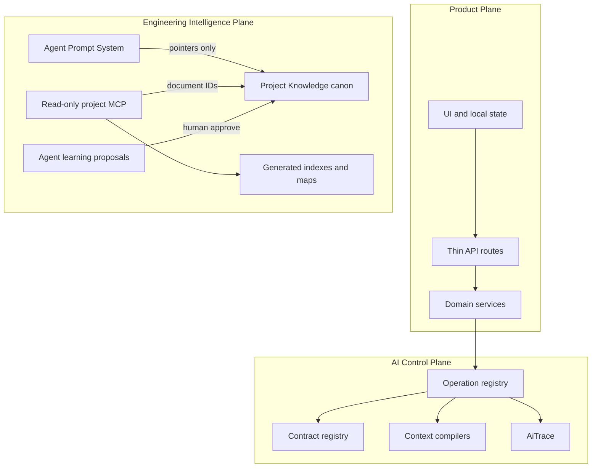

# AI Engineering Foundations Playbook

A portable, domain-agnostic transfer document for standing up the same foundation on another product.

**Audience:** founders and engineers who want the architecture, agent system, MCP posture, living documentation, and verification ladder—not a specific product journey.

**Voice:** auditor / scorekeeper. Claims that are implementation-proven are labeled; weaknesses are stated plainly.

**Authority of this file:** portable playbook under `docs/portability/`. It is **not** live product canon. Product truth for any concrete repo lives in that repo’s `project-knowledge/` (or equivalent).

---

## 1. Purpose, audience, and scope

### What this playbook answers

1. What is built into the foundation?
2. How does each layer work?
3. What benefits does it buy you?
4. How are IDE agents routed today?
5. How do MCP and living documents work?
6. How strong is the foundation, really?

### In scope

- Three-plane separation and independence rules
- Agent Prompt System (APS) + cold-start + Cursor adapters
- Living Project Knowledge + Guardian
- Read-only project-intelligence MCP
- AI Control Plane mechanisms (contracts, compilers, repair, traces)
- Product-plane workflow and storage patterns (portable shapes)
- Verification ladder, doctor checks, CI intent
- Porting checklist, do-not-adopt list, minimum viable cut
- Grounded strength scorecard

### Out of scope

- Domain prompts, business fixtures, and product-specific export contracts
- Publishing an npm template or extracting a package
- Claiming Cursor IDE hooks enforce APS when they do not in the live kit

---

## 2. Governing invariant and three planes

```text
Project Knowledge ≠ Agent Prompt System ≠ Product MCP ≠ Runtime Product Prompts
```

These four surfaces must stay separate. Collapsing them into one mutable “agent bible” is the most common failure mode in AI-assisted product repos: doctrine drifts, agents invent tools, runtime prompts get treated as architecture truth, and MCP gains write power it should never have.

### Three planes



| Plane | Responsibility | Typical locations |
|-------|----------------|-------------------|
| **Product** | Journey UI, local state, HTTP routes, export | `src/app/`, `src/features/<product>/`, `src/components/` |
| **AI Control** | Contracts, context assembly, op registry, traces, runtime prompts/schemas | `src/ai/`, feature `prompts/`, `schemas/`, `services/`, `validation/` |
| **Engineering Intelligence** | Doctrine, generated maps, Guardian, APS, read-only MCP, learning proposals | `project-knowledge/`, `agent-prompt-system/`, `mcp/`, `agent-learning/`, root `AGENTS.md` |

### Independence rules (portable)

- Client UI must not import server-only / model SDK modules
- The Next.js (or other) app must not depend on MCP at runtime
- Automated writers may only write under `project-knowledge/generated/` (or equivalent)
- APS `project-context/` holds **pointers** to canon—not a second copy of doctrine
- Runtime product prompts under feature folders are **not** Project Knowledge and **not** APS

---

## 3. How AI agents are built and routed

Agents in this foundation are not a separate runtime product. They are IDE-side workers (typically Cursor) constrained by cold-start doctrine, an APS router, optional skills, and a read-only MCP. Enforcement at the IDE layer is **soft** unless you add hooks later.

### 3.1 Cold-start layer (truth loading)

**Purpose:** Load the smallest truthful context before nontrivial work.

**Order:**

1. Root `AGENTS.md` (or equivalent entry)
2. Project Knowledge README
3. `CURRENT_STATE.md` (status vocabulary, treated literally)
4. Exactly one task-specific canonical document
5. Relevant source under `src/`

**Bootstrap preference:** call a project-intelligence MCP bootstrap tool when available; otherwise read the generated `agent-bootstrap.json` (or equivalent) from disk.

Cold-start answers: *what is true about this product right now?*

### 3.2 APS lean router (process loading)

**Purpose:** Give the agent the right workflow and context budget without a giant always-on prompt.

**Loop:**

1. Classify the request (investigation / planning / implementation / verification / audit / security / closeout)
2. Select **1–3** workflow IDs from `manifest.json`
3. Resolve only those workflows’ `project-context/` pointers → read canonical Project Knowledge targets
4. Emit a short task spec (goal, in/out, acceptance, verification)
5. Implement inside that scope
6. Finish with evidence labels: Verified / Partially verified / Not verified / Blocked / Assumed

**Typical workflow catalog (portable IDs):**

| Workflow | Use when |
|----------|----------|
| investigate-codebase | Locate behavior, map modules |
| plan-feature | Design before large edits |
| implement-change | Scoped coding |
| test-and-verify | Tests, doctor, verify |
| audit-existing-system | Honesty / readiness audits |
| security-review | Threat-focused review |
| closeout-report | Evidence-labeled completion |

**Pointer discipline:** `agent-prompt-system/project-context/*.md` must remain stubs that name canonical paths. If APS starts hosting doctrine, you have already violated the invariant.

APS answers: *how should this agent work on this request?*

### 3.3 Cursor surface (adapters)

| Piece | Role |
|-------|------|
| APS adapters under `agent-prompt-system/adapters/cursor/` | Source of truth for installable rules/skills |
| `agent:install` | Copies adapters into `.cursor/rules` and `.cursor/skills` |
| `agent:validate` | Manifest integrity, workflow uniqueness, pointer presence, sync check, leak checks |
| Always-on router rule | Requires APS brief + preflight for substantial tasks; allows bypass for typos / locate-a-file |
| Always-on bootstrap rule | Reinforces cold-start order |
| Opt-in skill (e.g. `aps-router`) | Explicit “use APS preflight” skill |
| Hand-authored product north-star rule | May sit **outside** `agent:install`—document that fact; do not pretend install owns it |

**Edit rule:** change adapters under APS, then reinstall. Do not hand-edit installed copies as the long-term SoT.

### 3.4 Soft enforcement reality (honesty)

**Verified pattern in the live kit:** APS routing is **convention + validation in CI/verify**, not Cursor stop-hooks or pre-tool hooks.

- There is typically **no** live `.cursor/hooks.json` APS enforcement in the portable kit
- Reference / archive agent-system hook kits (if present in a `Reference/` tree) are **advisory only** and must not be described as live
- Agents can ignore APS; humans and `agent:validate` catch structural drift, not every behavioral miss

If you need hard enforcement later, add hooks as an explicit upgrade—and re-score the APS plane upward only after they are Live.

### 3.5 Agent learning (Partial by design)

| Step | Reality |
|------|---------|
| Propose | Script appends a candidate learning note |
| Review | Human reviews; list/review scripts may exist without approve automation |
| Approve | Human promotes text into `approved/` (or equivalent) |
| Reject | Recorded trail when implemented |
| Auto-rewrite of AGENTS / canon / Cursor rules | **Forbidden** |

Empty `approved/` stubs are acceptable early. Do not advertise “progressive learning” as an operating system until approve procedures and content exist.

### 3.6 Precedence

```text
User instruction
  → safety / security
  → product boundaries
  → APS router
  → selected workflows
```

---

## 4. Product plane — portable patterns

These patterns stabilize multi-step AI product UX. Stage names and domain fields are product-specific; the machinery is not.

### 4.1 Thin routes → services

HTTP handlers parse input, call one service, map errors to a stable API error shape (code, message, requestId). No model SDK in the route file.

### 4.2 Workflow state machine

| Concept | Role |
|---------|------|
| Happy-path stages | Linear owner journey ending at a terminal export/complete state |
| Failure stages | Parallel set with retry policies and recovery hints |
| `TRANSITION_META` | Per-state: required inputs, allowed next, invalidate-downstream keys, retry policy, recovery hint |
| `canTransition` | Allowlist gate |
| Hard enforcement in reducer | Illegal moves keep current stage and data |
| `WorkflowDiagnostic` | Records illegal attempts (`ILLEGAL_TRANSITION`, from/to/action/time) |
| Separation rule | Diagnostics must **not** overwrite real operation failure codes |

**Benefits:** recoverable UX, no silent jumps to “done,” clear rewind invalidation of derived artifacts.

### 4.3 Storage envelope and migrations

```text
{ storageVersion, savedAt, project }
```

- Ordered migration chain from version N → current
- Wrap on save; unwrap + migrate on load
- Fail closed on future/unknown versions
- Legacy bare-project payloads may be accepted once, then wrapped

**Why:** local persistence (or any client store) survives schema churn without a database.

### 4.4 Typed product caps

Feature and upload policies (max questions, file allowlists, size limits) live in typed modules and are the single source of truth for UI `accept` attributes and server assertions.

---

## 5. AI Control plane — mechanism cards

### 5.1 Versioned contract registry

| | |
|---|---|
| **Problem** | Multi-step LLM pipelines drift when schemas are informal |
| **How** | Registry entries: contract id, schema version, owning plane, producer, consumers[], Zod schema |
| **Failure modes** | Registry out of sync with feature schemas; silent consumer mismatch |
| **Why reuse** | Auditable handoffs between stages |
| **Portable** | Yes (pattern); ids/schemas are product-specific |

### 5.2 AI operation registry

| | |
|---|---|
| **Problem** | Model calls scatter without declared recovery; phantom op ids appear in traces |
| **How** | Single `operationRegistry`; derive `AiOperationId` from registry keys. Public ops declare prompt path, `schemaName`, eval path. Nested repair is visibility=`nested` with `schemaName: null`. Constitution tests (`tests/ai/operations-registry.test.ts`) verify relationships in CI. |
| **Failure modes** | Ad-hoc calls bypass registry; README/maps treated as a second registry; unused registry mistaken for a runtime bus |
| **Why reuse** | Typed identity + declare-site relationships; services may pass typed literals — `getOperation()` is **not** required as an orchestration bus |
| **Portable** | Yes (pattern); op list is product-specific |

### 5.3 Context compilers + budgets + redaction

| | |
|---|---|
| **Problem** | Dumping full project state into the model burns tokens and leaks secrets |
| **How** | Per-op assembler → `{ packet, provenanceNotes, truncationWarnings, charCount, schemaVersions }`; char/list budgets; deep redact of secret-like patterns |
| **Failure modes** | Over-truncation; assembler omitted for an op; regex redaction incomplete |
| **Why reuse** | Stable, bounded, provenance-tagged context |
| **Portable** | Yes |

### 5.4 Decision ledger (rebuild-on-read)

| | |
|---|---|
| **Problem** | Facts, owner confirmations, hypotheses, and restrictions get conflated |
| **How** | Derive records from confirmed profile (+ answers); tag origins; summarize into compilers; **do not** persist a duplicate ledger for MVP |
| **Failure modes** | Heuristic mis-tags; not a durable multi-owner audit log |
| **Why reuse** | Accuracy labeling into brief/prompt (or equivalent) context |
| **Portable** | Yes (pattern) |

### 5.5 Repair policy (schema-keyed)

| | |
|---|---|
| **Problem** | Structured model output often fails validation; opaque retry loops hide failure |
| **How** | `getRepairPolicy(schemaName)` sets `maxAttempts` (e.g. ≤1 default, ≤2 for final compile). Parse with schema → optional semantic `validate` → repair up to policy → else `MODEL_OUTPUT_INVALID`. **Null/missing structured parse is not repaired.** Prefer `store: false`. Repair prompt is fenced instruction, not a second product SoT. |
| **Failure modes** | Repair still wrong; extra latency; treating repair prompt as product doctrine; repairing null parse |
| **Why reuse** | Highest ROI reliability pattern for structured LLM APIs with explicit budgets |
| **Portable** | Yes |

### 5.6 AiTrace

| | |
|---|---|
| **Problem** | Debugging needs telemetry without logging prompt bodies or PII |
| **How** | Behavioral tuple: typed `operationId` (`AiOperationId`), model, prompt/schema versions, input/output hashes, latency, status (`ok` / `repaired` / `validation_failed` / `error`), `repairAttempts`, `finalValidation`, budget/truncation counts |
| **Failure modes** | In-memory ring loses history on restart; hashes ≠ full reproducibility; phantom op strings in traces |
| **Why reuse** | Traceability without secret dumps |
| **Portable** | Yes; swap memory for a durable sink later |

### 5.7 Deterministic artifact lint

| | |
|---|---|
| **Problem** | Export quality cannot depend only on live LLM judges in CI |
| **How** | Deterministic lint on the exported artifact (required sections/signals, scope bans) |
| **Failure modes** | Regex gaming; English-centric; **domain rules must be rewritten per product** |
| **Why reuse** | Merge-gate quality without flaky live models |
| **Portable** | Pattern yes / rule content no |

### 5.8 Untrusted-data wrapping

| | |
|---|---|
| **Problem** | Uploads and extracted text can contain prompt-injection |
| **How** | Wrap untrusted JSON/text in explicit begin/end markers; instructions forbid following commands found inside |
| **Failure modes** | Model still complies with injected text; wrapping omitted on a path |
| **Why reuse** | Baseline instruction/data separation |
| **Portable** | Yes |

### 5.9 Config SoT (avoid policy twins)

| Surface | Role |
|---------|------|
| Upload policy module | Allowlists + size/row limits — the one real `src/config/*-policy.ts` SoT when needed |
| Model / timeouts / store | Live next to the OpenAI client (`lib/openai.ts` + env) — **do not** resurrect a parallel `model-policy.ts` |
| Feature caps / retention / architecture boundaries | Prefer constants near the owning feature or doctrine ADRs — **not** a family of unread `*-policy.ts` files that look authoritative |

**Constitution allowlist (RPB):** `src/config/*-policy.ts` must equal `upload-policy.ts` only. Decorative unused policy modules are the same failure class as unused registries.

---

## 6. Living Project Knowledge

### 6.1 Canon vs generated

| Tree | Who writes | Role |
|------|------------|------|
| Human canon (`*.md`, ADRs, feature notes, rules JSON) | Humans | Doctrine and decisions |
| `generated/` | Scripts only | Indexes, maps, reports with envelopes — **derived inventory**, not AI Control authority |

**Invariant:** machines never silently rewrite human canon. Agents may **propose** changes via learning; permanence requires human approval.

**Living Architecture Guardian lesson:** green maps/doctor do not prove op authority. Trust the operation registry + constitution tests for AI Control relationships; treat `runtime-prompts.json` and README tables as navigation only (see `project-knowledge/TOOLING.md` in the reference repo).

### 6.2 Status and freshness vocabulary

**Capability status (treat literally):**

Live · Partial · Prototype · Mocked · Planned · Blocked · Deprecated

**Document freshness:**

current · stale · historical · superseded

Overclaiming “Live” for Partial/Prototype systems is an agent-safety defect: agents stop investigating.

### 6.3 Pipeline

```text
knowledge:update  →  knowledge:check  →  knowledge:guardian
```

1. **update** — scan repo; write indexes/maps/reports under `generated/`
2. **check** — required generated artifacts exist and parse
3. **guardian** — hard/warn findings; fail verify/CI on hard codes

### 6.4 Artifact catalog (portable shape)

**Indexes:** docs-index, agent-bootstrap, reference-index  

**Maps:** repository-tree, routes, schemas, api-contracts, runtime-prompts, mcp-tools, dependencies, ownership  

**Reports:** GUARDIAN, STRUCTURE_WARNINGS, LARGE_FILES, CURRENT_STATE_GAPS, update-summary (+ optional audit snapshots)

Each generated JSON/MD should carry a do-not-hand-edit marker / envelope (generator, timestamp, content hash as applicable).

### 6.5 Ownership and quality rules

| File | Role |
|------|------|
| `ownership-rules.json` | Module owners for the generated ownership map (inventory) |
| `quality-rules.json` | Required doctrine docs, soft/hard line limits, generated marker string |

**Do not** ship unread `independenceRules` / `promptVersionHeuristics` blocks that look like policy — Guardian should **hardcode** the few HARD/WARN checks it actually runs, or wire JSON for real. AI Control relationships belong in constitution tests, not decorative ownership JSON.

### 6.6 Guardian code book (portable intent)

| Code | Severity | Meaning |
|------|----------|---------|
| PK-HARD-001 | hard | Missing required doctrine document |
| PK-HARD-002 | hard | Generated artifact missing do-not-hand-edit marker |
| PK-HARD-003 | hard | File exceeds hard line limit |
| PK-HARD-004 | hard | Client module imports server-only |
| PK-HARD-005 | hard | Required generated index missing |
| PK-WARN-001 | warn | File exceeds warning line threshold |
| PK-WARN-002 | warn | Runtime prompt version heuristic failed |
| PK-WARN-003 | warn | CURRENT_STATE area possibly missing from docs |
| PK-WARN-004 | warn | Reference manifest missing or unreadable |
| PK-WARN-005 | warn | MCP directory absent |

Thresholds and required-doc lists are knobs; the **code registry pattern** is the foundation.

---

## 7. Project-intelligence MCP

### 7.1 Role

- Host-stdio (or equivalent) MCP for IDE agents
- **Read-only**
- Document-ID allowlisted (not free filesystem browse)
- **Not** a runtime dependency of the product app
- Prefix renamed per product (pattern portable; prefix itself is product-specific)

### 7.2 Tool roles (portable naming)

| Role | Purpose |
|------|---------|
| get_agent_bootstrap | Cold-start packet |
| list / find / read project docs | Allowlisted document access |
| product_overview / architecture_map / current_state | High-signal summaries |
| repository_tree / route / prompt / schema inventories | Generated map access |
| get_guardian_report | Latest Guardian findings |
| get_reference_concept | Advisory concepts only (never overrides canon) |

### 7.3 Security stack

1. **Docs registry** — ID → path allowlist; unknown IDs fail  
2. **Path jail** — reject `..`, enforce realpath under repo, ban archive/product-forbidden trees  
3. **ToolEnvelope** — status `complete` | `partial` | `failed`; source identity/hash; secret redaction; stable text serialization for the model  
4. **Stdout discipline** — protocol on stdout; logs on stderr  
5. **Allowlist-drift tests** — registered tools must stay inside the approved set; ban write-like prefixes  

### 7.4 Profiles and lockdown tiers

| Tier | Examples |
|------|----------|
| **Always enabled** | Project-intelligence MCP; Context7 (library docs only) |
| **On demand** | GitHub read-only; browser automation; web research for developers |
| **Disabled** | GitHub write/merge/delete/push; MCP gateway self-modification; repo mutation; YouTube/research-future profiles during MVP; filesystem/shell MCP as product intelligence |

**Context7 rule:** technical library documentation only. Never treat it as product, company, or Project Knowledge truth.

### 7.5 Critical honesty: policy vs Cursor session

Repo files can describe a perfect `development` profile while Cursor still has a Docker gateway with write tools enabled.

| Surface | What “green” means |
|---------|-------------------|
| Repo MCP | Smoke + allowlist-drift + doctor pass |
| Cursor session | Owner enabled the project MCP and disabled write/gateway tools |

**Porting the folders without owner lockdown does not reproduce MCP governance strength.**

### 7.6 Version pinning

Pin the MCP SDK. Treat protocol/SDK majors as reviewed dependency changes. Require MCP tests before merge.

---

## 8. Reference / advisory authority model

Never reverse this order:

1. **Live Project Knowledge** — product doctrine  
2. **Live source** — what the software actually does  
3. **Distilled Reference concepts** — portable ideas, advisory  
4. **Product-specs / agent-systems advisory** — historical kits  
5. **Archives** — patterns only; not live SoT  

Maintain a porting-notes document with explicit **adopt / do-not-adopt** markers when importing from prior systems.

---

## 9. Verification ladder and doctor inventory

### 9.1 Umbrella

```text
doctor
  → lint → typecheck → unit / route / eval tests
  → knowledge update / check / guardian
  → APS validate → MCP test / doctor
  → production build → mocked e2e
```

**Habit:** local `dev` starts with doctor (fail closed). CI runs the same umbrella (or a faithful subset). Humans and agents share one gate.

### 9.2 Doctor checks (portable intent)

Doctor is a **fast architecture health** pass—not semantic proof of product quality.

1. Application scaffold present  
2. Environment example / local expectations  
3. Model client server isolation  
4. Schema / contract registry present  
5. Prompt / operations registry present  
6. Project Knowledge present  
7. Generated inventory present  
8. Guardian hard-fail count = 0  
9. MCP allowlist posture (ban write-like tool prefixes)  
10. State migration registry present  
11. Evaluation fixtures present  
12. Reference manifest present (if Reference library is used)  
13. MCP profiles YAML present  

### 9.3 Other gates

| Gate | Role | Honesty |
|------|------|---------|
| Unit / service tests | Reducer, ledger, repair path, formatters, auth-boundary invariant owners | Live when present |
| AI Control constitution | Op ↔ prompt ↔ schema ↔ eval ↔ repair; runtime-prompts version match; policy-module allowlist | Live via `npm test` inside verify |
| Route tests | Mock services; assert HTTP + error codes | Live when present |
| Eval / contract tests | Deterministic lint + injection/scope guards; **no live LLM required** | Live when present |
| Mocked E2E | Full UI journey with APIs mocked | Live when configured |
| precommit-fast | Secrets heuristic, generated protection, forbidden imports | Often **Partial** until hook-wired |
| CI + Dependabot | Remote verify; hold sensitive majors (e.g. MCP SDK) | Live when workflows exist |
| Branch protection | Require verify check on default branch | Owner action after first remote run |
| Foundation-readiness audit | Scores + Live/Partial matrix | Ritual pattern |
| Owner smoke | Real or intentional live API journey + evidence artifacts | Ritual pattern |

---

## 10. Benefits summary (scorekeeper)

| Benefit | What produces it |
|---------|------------------|
| Honest status for humans and agents | CURRENT_STATE vocabulary + evidence labels |
| Smaller agent context | APS ≤3 workflows + pointer resolution |
| Lower MCP blast radius | Read-only allowlist + owner lockdown tiers |
| Mergeable AI quality | Deterministic lints/evals + schema-keyed repair policy + mocked E2E |
| Provenance | Contracts, decision ledger, AiTrace hashes |
| Safer evolution | Migrations, generated-only writes, learning approval gate |
| Faster diagnosis | Doctor + Guardian codes + inventories |
| Plane clarity | Ownership rules and four-way invariant |

---

## 11. Grounded strength evaluation

Scores below describe a **reference implementation of this foundation** after a hardening pass that added hard workflow enforcement, API/E2E tests, MCP lockdown docs, and living-knowledge gates. They are **not** a promise that copying folders yields the same score.

| Area | Score | Evidence label | Notes |
|------|------:|----------------|-------|
| Plane separation / doctrine | 8.5/10 | Verified | Strong invariants + ADRs; residual risk if Reference is misread as SoT |
| AI Control plane | 9.5/10 | Verified | Typed `AiOperationId`, constitution tests, schema-keyed repair, invariant owners, traces; live-LLM evals are not the merge gate |
| Product workflow enforcement | 8/10 | Verified | Hard transitions + diagnostics after hardening |
| Agent Prompt System | 7/10 | Partially verified | Lean Live kit; soft routing; thin workflows; Gate C hooks Planned |
| Living Project Knowledge | 8/10 | Verified | Real update/check/guardian; maps are **inventory**, not authority verifier |
| MCP design (in repo) | 8/10 | Verified | Read-only allowlist, path jail, envelope, drift tests |
| MCP governance (Cursor session) | 4.5/10 | Partially verified | Policy docs Live; session surface often still includes write/gateway tools until owner acts |
| Agent learning | 4/10 | Verified | Propose/review only; approved content empty/stub by design |
| Verification / CI | 8/10 | Verified | verify umbrella + CI + constitution via vitest; precommit hook may remain unwired |
| Testing (unit/route/eval/e2e) | 8/10 | Verified | After hardening: route suites, mocked E2E, eval fixtures |
| **Overall foundation** | **8.5/10** | Partially verified | AI Control mechanism closure is strong; weakest links remain Cursor MCP surface, soft APS enforcement, learning automation |

### What pulls the score up

1. Living knowledge pipeline with hard Guardian codes (scaffold hygiene)  
2. Serious read-only MCP design tested in-repo  
3. Typed op registry + constitution tests + context compilers + repair policy  
4. Shared doctor → verify ladder (scaffold vs relationship ownership)  
5. Honest status vocabulary when CURRENT_STATE is maintained  

### What pulls the score down

1. Cursor session ≠ policy until owner lockdown  
2. APS fail-open without IDE hooks  
3. Agent-learning is not yet an operating system  
4. Doctor is inventory/smoke, not deep semantic proof (by design — constitution owns AI relationships)  
5. Porting without CURRENT_STATE honesty collapses agent reliability  

**Rule for porters:** folder layout without owner MCP lockdown, CURRENT_STATE discipline, and constitution tests **does not** reproduce this score.

---

## 12. Porting checklist

1. Create three-plane folder skeleton + ownership map (owners only — no decorative unread rules)  
2. Stand up Project Knowledge + CURRENT_STATE + Guardian HARD/WARN + quality-rules (executed keys only)  
3. Install lean APS (core, workflows, pointer project-context, install/validate)  
4. Add cold-start `AGENTS.md` + bootstrap rule; sequence cold-start **then** APS  
5. Add read-only MCP + ToolEnvelope + docs-registry + allowlist-drift + profiles YAML  
6. Run owner Cursor lockdown (always / on-demand / disabled); confirm project tools appear  
7. Add contract + typed op registry before the second LLM call  
8. Add context compilers + redact + budgets + schema-keyed repair policy + typed traces  
9. Add constitution tests (op relationships, inventory version subordination, policy-module allowlist)  
10. Add upload-policy (or equivalent) as the single real config `*-policy` SoT; model/timeouts beside the client — ban parallel policy twins  
11. Add workflow FSM + diagnostics + storage migrations + one server-owned invariant for critical transitions  
12. Wire doctor → verify → CI; decide whether to hook precommit-fast  
13. Write first foundation-readiness audit with honest Live/Partial labels  
14. Rename tool prefixes and contract IDs; **do not** copy domain export contracts or product north-star text blindly  

---

## 13. Explicit do-not-adopt

- Write MCP, filesystem MCP, or shell MCP as product intelligence  
- Auto-rewriting `AGENTS.md`, Cursor rules, or Project Knowledge canon  
- Discovery / SEO / crawl tool farms as “foundation”  
- Vector RAG as the default foundation layer  
- Treating Reference / archives as live source of truth  
- Making MCP a runtime dependency of the product app  
- Using live-LLM evals as the **only** merge gate  
- Claiming APS IDE hooks exist when only advisory Reference kits have them  
- Using Context7 (or any docs/web MCP) as product or company truth  
- Silent MCP SDK / protocol major upgrades  
- Wiring `getOperation()` / registry as an orchestration bus “for completeness”  
- CI-blocking LLM architecture auditors as source of truth  
- Decorative SoT JSON (unread independenceRules / promptVersionHeuristics / parallel `*-policy.ts`)  
- Treating generated maps or README tables as executable ops authority  

---

## 14. Minimum viable foundation cut

Smallest subset that still protects the four-way invariant:

1. Project Knowledge + CURRENT_STATE + generated-only write boundary  
2. Cold-start `AGENTS.md`  
3. Lean APS with pointer project-context + one router rule  
4. Read-only project MCP **or** a strict owner policy of “no write MCP in this workspace”  
5. Contract registry + typed ops + repair policy + constitution tests for structured model calls  
6. `doctor` + `verify` umbrella  

Everything else (Guardian codes, AiTrace sinks, mocked E2E, learning pipeline, Dependabot) increases strength but is not the first brick.

---

## 15. Evidence labels

Use these at the end of agent work and in audits:

| Label | Meaning |
|-------|---------|
| **Verified** | Confirmed against code, tests, or a successful command in this environment |
| **Partially verified** | Partially confirmed; material uncertainty remains |
| **Not verified** | Not checked |
| **Blocked** | Could not check (permissions, missing tools, environment) |
| **Assumed** | Taken as true without direct evidence; call it out |

When scoring foundation strength, prefer **Partially verified** over inflated **Verified** whenever Cursor session state or human process is part of the claim.

---

## Appendix A — Origin note

This playbook was distilled from a working reference implementation that ships a three-plane AI product foundation (living Project Knowledge, lean APS, read-only project MCP, contract/op registries, workflow enforcement, and a doctor/verify ladder). Product-domain journeys and export contracts were intentionally excluded so the document remains portable.

## Appendix B — Suggested folder skeleton for a new repo

```text
AGENTS.md
project-knowledge/
  README.md
  CURRENT_STATE.md
  ARCHITECTURE.md
  PRODUCT.md
  DECISIONS/
  FEATURES/
  ownership-rules.json
  quality-rules.json
  scripts/
  generated/
agent-prompt-system/
  SYSTEM.md
  manifest.json
  core/
  workflows/
  project-context/
  adapters/cursor/
  scripts/
mcp/
  src/
  test/
  README.md
agent-learning/
  candidates/
  approved/
  scripts/
src/
  ai/
    contracts/
    operations/
    context/
    traces/
  config/
  features/<product>/
docs/
  portability/
  ai/
.github/workflows/
```

---

*End of playbook.*
