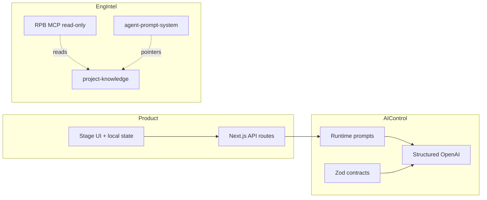

# ARCHITECTURE — Three Planes

Research Prompt Builder separates concerns into three planes so product doctrine, AI control, and engineering intelligence do not collapse into one blob.

## Planes

| Plane | Responsibility | Primary locations |
|-------|----------------|-------------------|
| **Product** | User journey, UI stages, local project state, export | `src/app`, `src/features/research-prompt-builder`, `src/components` |
| **AI Control** | Runtime prompts, schemas, structured OpenAI calls, validation/repair, context assembly | `src/features/.../prompts`, `schemas`, `services`, `src/ai` |
| **Engineering Intelligence** | Canonical docs, generated maps, guardian, APS routing, read-only MCP | `project-knowledge`, `agent-prompt-system`, `mcp`, `agent-learning`, `AGENTS.md` |

## Hard boundaries

1. MCP is **not** a runtime dependency of the Next.js app.
2. APS workflows must not embed MarketMonth product doctrine.
3. Generated knowledge writes only under `project-knowledge/generated/`.
4. `Reference/` is advisory; never import as live SoT.
5. Client components must not import `server-only` modules.

## API surface (MVP)

- `POST /api/documents/extract`
- `POST /api/company/understand`
- `POST /api/interview/next`
- `POST /api/research-brief`
- `POST /api/research-prompt`

## State

Single-user local project state (reducer + storage). No database in MVP.
